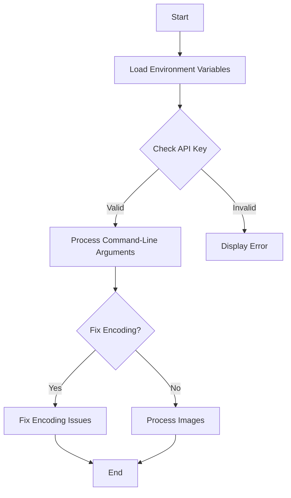
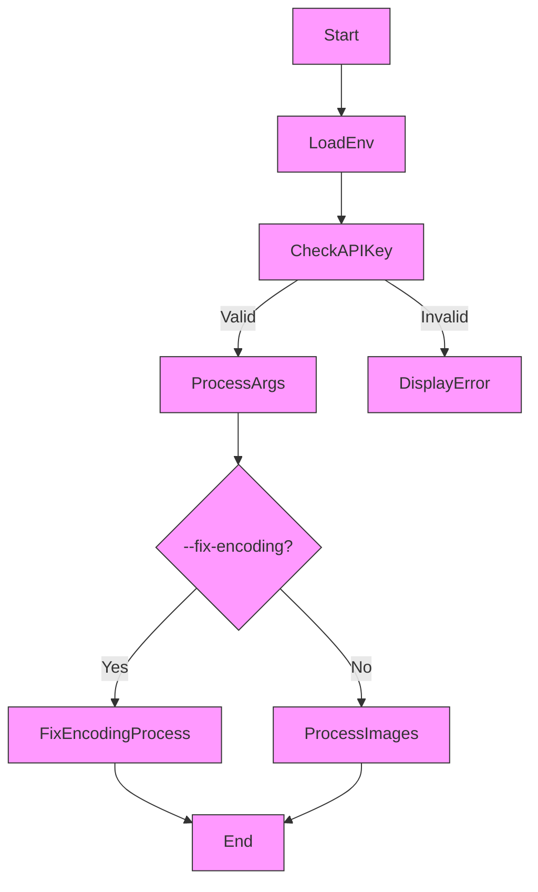

# Image Caption Generator
_v1.0.5_
**Generate detailed and accurate captions for images using OpenAI.**


## Introduction

The Image Caption Generator is a powerful tool designed to generate detailed and accurate captions for images using OpenAI's API. It is ideal for creating training sets for AI models, enhancing image metadata, and more.

## Overview

`gen-captions.py` is a Python script that uses OpenAI's API to generate descriptive captions for images in a specified directory. It also includes functionality to fix encoding issues in text files. Originally intended to support the creation of training sets for the [AI-Toolkit](https://github.com/yourusername/ai-toolkit) GitHub project, it has evolved into a versatile and reusable tool suitable for various image captioning tasks.

## Table of Contents

- [gen-captions.py](#gen-captionspy)
  - [Overview](#overview)
  - [Table of Contents](#table-of-contents)
  - [Features](#features)
  - [Prerequisites](#prerequisites)
  - [Installation](#installation)
  - [Usage](#usage)
    - [Command-Line Arguments](#command-line-arguments)
    - [Examples](#examples)
  - [Configuration](#configuration)
    - [Environment Variables](#environment-variables)
    - [Sample `.env` File](#sample-env-file)
  - [Diagram](#diagram)
  - [Logging](#logging)
  - [Error Handling](#error-handling)
  - [Contributing](#contributing)
  - [License](#license)
  - [Contact](#contact)

## Quick Start Guide

Follow these steps to quickly set up and run the Image Caption Generator:

1. **Clone the repository:**

   ```bash
   git clone <repository_url>
   cd lora-train
   ```

2. **Install dependencies:**

   ```bash
   pip install -r requirements.txt
   ```

3. **Set up environment variables:**

   Create a `.env` file in the project root or set the variables in your environment.

   ```properties
   OPENAI_API_KEY=your_openai_api_key
   GETCAP_THREAD_POOL=50
   GETCAP_THROTTLE_SUBMISSION_RATE=10
   GETCAP_THROTTLE_RETRIES=100
   GETCAP_THROTTLE_BACKOFF_FACTOR=2
   GETCAP_LOG_LEVEL=INFO
   ```

4. **Run the script:**

   ```bash
   python gen-captions.py --image-dir <image_directory> --caption-dir <caption_directory> --config-dir <config_directory>
   ```

## Features

- Generate detailed captions using OpenAI's API, suitable for use as prompts in image generation models like Stable Diffusion.
- Asynchronous processing of images with configurable thread pooling.
- Automatic handling of API rate limiting with exponential backoff retries.
- Fix encoding issues in existing text and configuration files.
- Detailed logging with customizable log levels via environment variables.
- Highly configurable through environment variables and command-line arguments.

## Prerequisites

- Python 3.x
- An OpenAI API key
- Required Python packages (listed in `requirements.txt`)

## Installation

1. **Clone the repository:**

   ```bash
   git clone <repository_url>
   cd lora-train
   ```

2. **Install dependencies:**

   ```bash
   pip install -r requirements.txt
   ```

3. **Set up environment variables:**

   Create a `.env` file in the project root or set the variables in your environment.

   ```properties
   OPENAI_API_KEY=your_openai_api_key
   GETCAP_THREAD_POOL=50
   GETCAP_THROTTLE_SUBMISSION_RATE=10
   GETCAP_THROTTLE_RETRIES=100
   GETCAP_THROTTLE_BACKOFF_FACTOR=2
   GETCAP_LOG_LEVEL=INFO
   ```

## Usage

Run the script using the command line with the required arguments.

```bash
python gen-captions.py --image-dir <image_directory> --caption-dir <caption_directory> --config-dir <config_directory>
```

### Command-Line Arguments

- `--image-dir`: Path to the directory containing images.
- `--caption-dir`: Path to the directory where captions will be saved.
- `--config-dir`: Path to the configuration directory.
- `--fix-encoding`: Optional flag to fix encoding issues in text and config files.

### Examples

**Generate captions for images:**

```bash
python gen-captions.py --image-dir ./images --caption-dir ./captions --config-dir ./config
```

**Fix encoding issues in text and configuration files:**

```bash
python gen-captions.py --fix-encoding --caption-dir ./captions --config-dir ./config
```

**Generate captions for images:**

```bash
python gen-captions.py --image-dir ./images --caption-dir ./captions --config-dir ./config
```

**Fix encoding issues in text and configuration files:**

```bash
python gen-captions.py --fix-encoding --caption-dir ./captions --config-dir ./config
```

## Configuration

Customize the script behavior using environment variables in the `.env` file or directly in your shell.

### Environment Variables

- `OPENAI_API_KEY`: Your OpenAI API key.
- `GETCAP_THREAD_POOL`: Number of threads for concurrent processing.
- `GETCAP_THROTTLE_SUBMISSION_RATE`: API submission rate throttling.
- `GETCAP_THROTTLE_RETRIES`: Maximum number of retries on rate limiting.
- `GETCAP_THROTTLE_BACKOFF_FACTOR`: Exponential backoff factor for retries.
- `GETCAP_LOG_LEVEL`: Logging level (e.g., `DEBUG`, `INFO`, `WARNING`).

### Sample `.env` File

```properties
OPENAI_API_KEY=your_openai_api_key
GETCAP_THREAD_POOL=50
GETCAP_THROTTLE_SUBMISSION_RATE=10
GETCAP_THROTTLE_RETRIES=100
GETCAP_THROTTLE_BACKOFF_FACTOR=2
GETCAP_LOG_LEVEL=INFO
```

## Workflow Diagram



The flow of the script can be visualized with the following diagram:



## Logging

Logs are formatted to include timestamps, thread names, and log levels for better traceability. Adjust the `GETCAP_LOG_LEVEL` environment variable to control verbosity.

## Error Handling

- Implements exponential backoff when encountering rate limiting from the OpenAI API.
- Catches and logs exceptions during image processing without halting the entire script.
- Provides detailed error messages to assist in debugging.

## Testing

To ensure the functionality of the Image Caption Generator, run the tests using `pytest`:

```bash
pytest
```

This will execute all test cases and verify that the code is working as expected.

## Troubleshooting

If you encounter issues, consider the following solutions:

- **Missing Dependencies:** Ensure all dependencies are installed by running `pip install -r requirements.txt`.
- **API Key Errors:** Verify that the `OPENAI_API_KEY` is correctly set in your environment variables.

## System Information

The script logs system information and environment variable settings using the `print_system_info` function, which helps in diagnosing issues related to the execution environment.

## Contributing

Contributions are welcome! Please fork the repository and submit a pull request for any enhancements or bug fixes. For detailed guidelines, refer to the `CONTRIBUTING.md` file.

## Changelog

For a detailed list of changes and updates, refer to the `CHANGELOG.md` file.

## Contributing

Contributions are welcome! Please fork the repository and submit a pull request for any enhancements or bug fixes.

## License

MIT

## Contact

For any questions or support, please open an issue on the GitHub repository or contact [your_email@example.com].

---

*Note: This project was originally intended to support the creation of training sets for the [AI-Toolkit](https://github.com/ostris/ai-toolkit.git) project but has since evolved into a versatile and reusable tool for generating image captions.*
