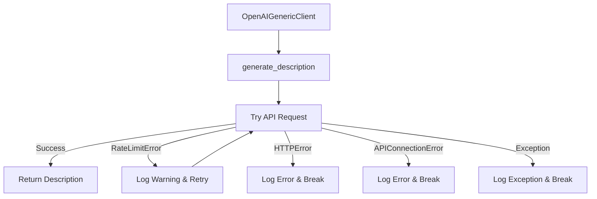
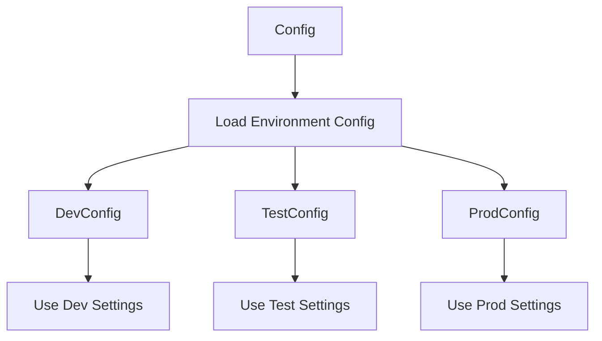
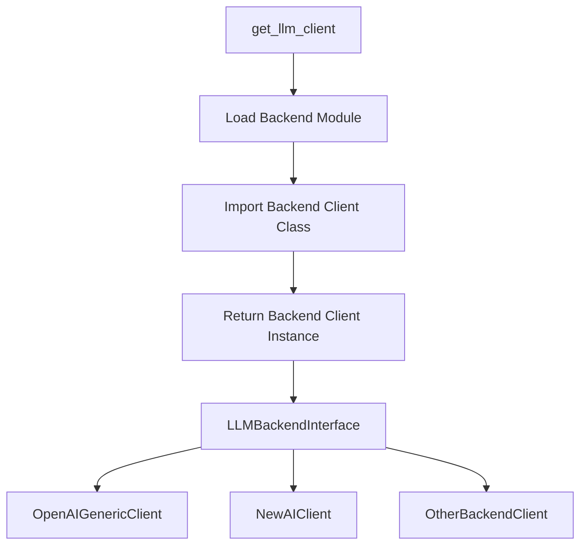
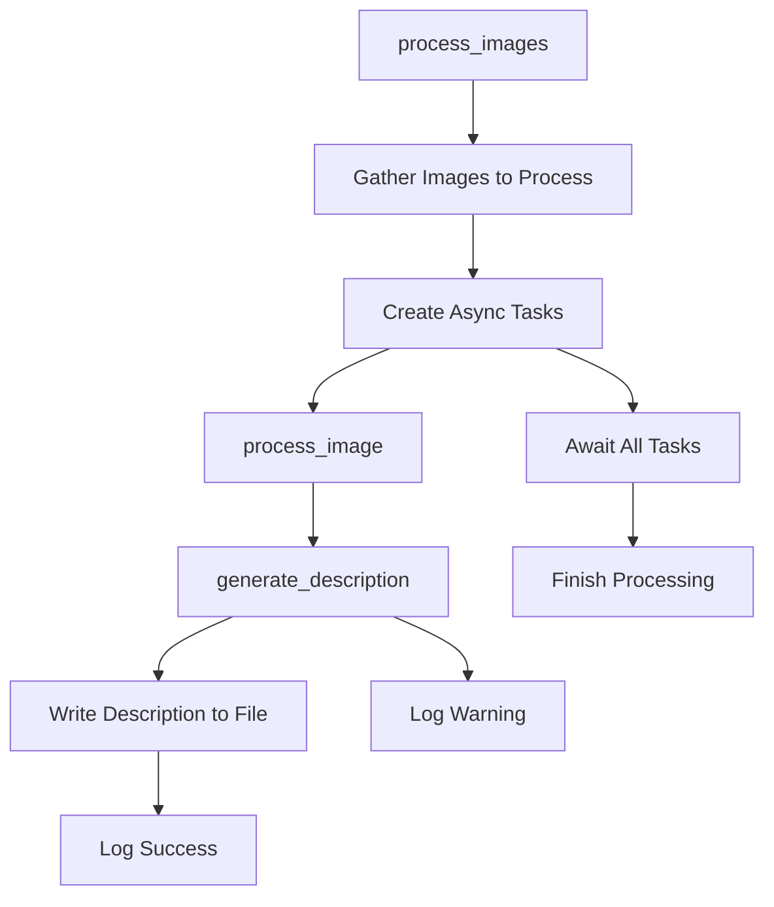
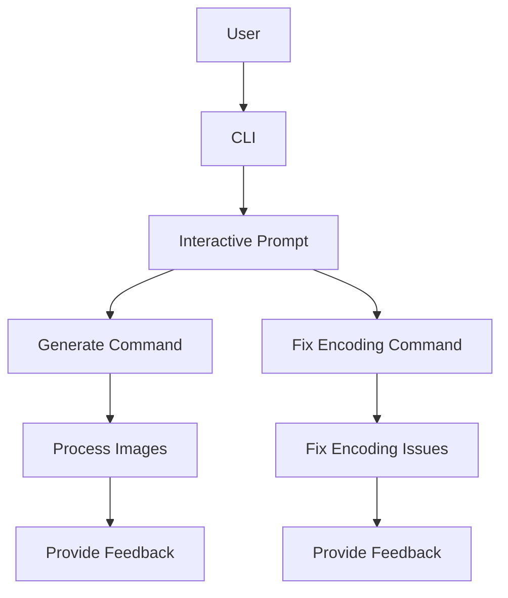

# Comprehensive Analysis of the Codebase and Roadmap

## Overview

The codebase provided is for a Python application named "gen_captions" that generates image captions using language models (LLMs) like OpenAI or GROK. The application is structured to be run from the command line and is configured using the Pants build system. The codebase includes configuration management, a command-line interface, logging, and utilities for processing images and managing encoding issues.

## Code Structure

The codebase is organized into several modules, each serving a specific purpose. Here's a high-level overview of the structure:

```plaintext
gen_captions/
├── __init__.py
├── cli.py
├── config.py
├── encoding_fixer.py
├── image_processor.py
├── llm_client.py
├── logger_config.py
├── openai_generic_client.py
├── system_info.py
└── utils.py
```

### Configuration Management

**File: `config.py`**

The `Config` class manages the application's configuration settings. It retrieves environment variables and provides default values if they are not set. The configuration includes settings for the LLM API, thread pool size, logging level, and throttling parameters.

Key Points:
- The configuration is initialized with default values and can be overridden by environment variables.
- The `set_backend` method configures the LLM API settings based on the specified backend (e.g., OpenAI or GROK).

### Command-Line Interface

**File: `cli.py`**

The command-line interface (CLI) is built using the `typer` library, which simplifies the creation of CLI applications. The CLI provides commands for generating environment files, fixing encoding issues, and generating image captions.

Key Points:
- The `gen_env` command creates a `.env` file with environment variables, using existing values if available.
- The `fix_encoding` command addresses encoding issues in text files within specified directories.
- The `generate` command processes images to generate captions using the specified LLM backend.

### Logging Configuration

**File: `logger_config.py`**

The logging configuration is handled by the `CustomLogger` class, which sets up logging with a custom format. It supports concurrent logging using the `ConcurrentRotatingFileHandler` and integrates with the `rich` library for enhanced console output.

Key Points:
- The logger includes filters for date-time and thread information.
- Log messages are formatted to include process and thread identifiers, which is useful for debugging in multi-threaded environments.

### Image Processing

**File: `image_processor.py`**

The `process_images` function processes images in a specified directory, generating captions using the chosen LLM backend. It uses a thread pool to handle multiple images concurrently and throttles the submission rate to avoid overwhelming the API.

Key Points:
- Images are processed only if they do not already have a corresponding caption file.
- The function uses a progress bar to provide feedback on the processing status.
- Captions are generated by the LLM client and saved to text files.

### LLM Client Factory

**File: `llm_client.py`**

The `get_llm_client` function is a factory method that returns an LLM client based on the specified backend. It currently supports OpenAI and GROK backends.

Key Points:
- The function logs the backend configuration and initializes the appropriate client.
- If an unknown backend is specified, it raises a `ValueError`.

### OpenAI Generic Client

**File: `openai_generic_client.py`**

The `OpenAIGenericClient` class interacts with the OpenAI API to generate image descriptions. It handles API errors and rate limits, retrying requests as necessary.

Key Points:
- The client builds request parameters dynamically based on model-specific quirks.
- It checks for the presence of a `[trigger]` token in the response to ensure the description is valid.
- The client uses exponential backoff for retrying requests after rate limit errors.

### Encoding Fixer

**File: `encoding_fixer.py`**

The `fix_encoding_issues` function scans directories for text files and attempts to fix encoding issues by converting files to UTF-8.

Key Points:
- It supports multiple encodings and logs any errors encountered during the process.
- The function uses a progress bar to indicate the status of the encoding fixes.

### System Information

**File: `system_info.py`**

The `print_system_info` function displays system information and environment variable settings, providing context for debugging and configuration.

Key Points:
- It uses the `rich` library to format the output in a table.
- The function logs system information and environment variables prefixed with `GETCAP_`.

### Utility Functions

**File: `utils.py`**

This module contains utility functions used throughout the application, such as checking if a prompt file exists and encoding images to base64.

Key Points:
- The `prompt_exists` function checks if a file exists and is not empty.
- The `encode_image` function reads an image file and encodes it to base64 for API requests.

## Dependencies and Configuration

**File: `pants.toml`**

The `pants.toml` file configures the Pants build system, specifying the version, backend packages, and various settings for linting, type checking, and testing.

Key Points:
- The configuration includes settings for Python interpreter constraints and resolves.
- It enables various linting tools like Black, Flake8, and Pylint, as well as type checking with MyPy.

## Conclusion

The codebase is well-structured, with clear separation of concerns across different modules. It leverages modern Python libraries like `typer` and `rich` to provide a user-friendly command-line interface and enhanced console output. The use of a factory pattern for LLM clients allows for easy extension to support additional backends. The application is designed to handle concurrency and rate limits effectively, making it robust for processing large batches of images.
# Improvements Addendum

## Improvement Addendum 1: Enhanced Error Handling and Logging

### Summary
The current error handling in the codebase is functional but can be improved to provide more detailed insights into failures. Enhancing error handling and logging will help in diagnosing issues more effectively and ensuring that the application can recover gracefully from unexpected situations.

### Importance
- **For Developers**: Improved error handling will make debugging easier and reduce the time spent on identifying and fixing issues.
- **For Non-Developers**: More informative error messages can help in understanding what went wrong without needing to dive into the code.

### High-Level Details
- Implement more granular exception handling to capture specific errors and provide detailed logs.
- Enhance log messages with contextual information to aid in troubleshooting.
- Consider implementing a centralized error reporting system to track and analyze recurring issues.

## Improvement Addendum 2: Modularize Configuration Management

### Summary
The configuration management can be further modularized to support different environments (e.g., development, testing, production) and make it easier to manage and update configurations.

### Importance
- **For Developers**: Modular configuration management simplifies the process of switching between environments and reduces the risk of configuration errors.
- **For Non-Developers**: Clear separation of configuration settings can help in understanding how different environments are set up and managed.

### High-Level Details
- Introduce environment-specific configuration files or sections within the existing configuration.
- Use a configuration management library to handle loading and merging configurations from multiple sources.
- Provide documentation on how to set up and switch between different configurations.

## Improvement Addendum 3: Expand LLM Backend Support

### Summary
The current implementation supports only OpenAI and GROK backends. Expanding support to include additional LLM backends will make the application more versatile and appealing to a broader audience.

### Importance
- **For Developers**: Adding support for more backends can increase the application's utility and attract more users.
- **For Non-Developers**: More backend options provide flexibility in choosing the best LLM for specific needs or constraints.

### High-Level Details
- Research and identify popular LLM backends that could be integrated.
- Implement a plugin architecture to make it easier to add new backends without modifying the core codebase.
- Ensure that the configuration and CLI support dynamic backend selection.

## Improvement Addendum 4: Optimize Image Processing Workflow

### Summary
The image processing workflow can be optimized to improve performance and reduce resource consumption, especially when handling large batches of images.

### Importance
- **For Developers**: Optimizing the workflow can lead to faster processing times and lower operational costs.
- **For Non-Developers**: Improved performance ensures that the application can handle large workloads efficiently, which is crucial for scalability.

### High-Level Details
- Analyze the current workflow to identify bottlenecks and areas for improvement.
- Consider implementing asynchronous processing or leveraging more advanced concurrency models.
- Optimize image encoding and decoding operations to reduce processing time.

## Improvement Addendum 5: Enhance User Interface and Experience

### Summary
The command-line interface can be enhanced to provide a more intuitive and user-friendly experience, making it easier for users to interact with the application.

### Importance
- **For Developers**: A better user interface can reduce the learning curve for new users and improve overall satisfaction.
- **For Non-Developers**: An intuitive interface makes it easier to use the application without needing extensive technical knowledge.

### High-Level Details
- Implement interactive prompts and guided workflows to assist users in configuring and running the application.
- Provide detailed help messages and examples for each command and option.
- Consider developing a graphical user interface (GUI) for users who prefer visual interactions over command-line operations.

## Improvement Addendum 6: Comprehensive Documentation and Tutorials

### Summary
While the codebase includes some documentation, expanding it to include comprehensive guides and tutorials will help users understand and utilize the application more effectively.

### Importance
- **For Developers**: Detailed documentation can serve as a reference for maintaining and extending the application.
- **For Non-Developers**: Tutorials and guides can help users get started quickly and understand the application's capabilities.

### High-Level Details
- Develop a user manual that covers installation, configuration, and usage scenarios.
- Create tutorials and example projects to demonstrate the application's features and potential use cases.
- Maintain an up-to-date FAQ section to address common questions and issues.
# Improvement Addendum 1: Enhanced Error Handling and Logging

## In-Depth Analysis

### Design and Architecture

The goal of enhancing error handling and logging is to provide more detailed insights into failures and ensure that the application can recover gracefully from unexpected situations. This involves implementing more granular exception handling, enhancing log messages with contextual information, and potentially introducing a centralized error reporting system.

#### Key Design Considerations

1. **Granular Exception Handling**: Capture specific exceptions rather than generic ones to provide more informative error messages.
2. **Contextual Logging**: Include additional context in log messages, such as function names, parameters, and state information.
3. **Centralized Error Reporting**: Consider integrating with a service like Sentry or Loggly for centralized error tracking and analysis.

### Code Changes

#### Enhanced Exception Handling

In the `openai_generic_client.py`, we can improve the exception handling by capturing specific exceptions and providing detailed log messages.

```python
import time
from logging import Logger

from openai import APIConnectionError, OpenAI, RateLimitError
from requests import HTTPError
from rich.console import Console

from .config import Config
from .utils import encode_image

class OpenAIGenericClient:
    """OpenAI generic API client for interacting with."""

    def __init__(self, config: Config, console: Console, logger: Logger):
        """Initialize the OpenAI client with the API key and base URL."""
        self._client = OpenAI(api_key=config.LLM_API_KEY, base_url=config.LLM_BASE_URL)
        self._config = config
        self._console = console
        self._logger = logger

    def generate_description(self, image_path: str) -> str:
        """Generate a description for the image using the OpenAI API."""
        self._logger.info("Processing image with LLM: %s", image_path)
        self._console.print(f"[green]Generating description for:[/] [italic]{image_path}[/]")

        base64_image = encode_image(image_path)
        retries = 0

        while retries < self._config.THROTTLE_RETRIES:
            try:
                payload = self._build_chat_request(base64_image)
                response = self._client.chat.completions.create(**payload)

                if response and response.choices and response.choices[0] and response.choices[0].message and response.choices[0].message.content:
                    description = response.choices[0].message.content.strip()

                    if not description:
                        self._console.print(f"[yellow]No content returned by LLM for:[/] {image_path}")
                        return ""

                    if "[trigger]" not in description:
                        self._logger.info(r"Missing \[trigger] token for %s. Retrying...", image_path)
                        self._console.print(rf"[bold yellow]No \[trigger] token in response for {image_path}, retrying...[/]")
                        time.sleep(1)
                        retries += 1
                        continue

                    self._console.print("[bold green]Generated description for:[/] [italic]{image_path}[/]")
                    return description

                self._console.print(f"[yellow]No content returned by LLM for:[/] {image_path}")
                return ""

            except RateLimitError as re:
                wait_time = self._config.THROTTLE_BACKOFF_FACTOR ** (retries + 1)
                self._logger.warning("Rate limit exceeded. Retrying in %s seconds...", wait_time)
                self._console.print(f"[bold yellow]Rate limit for {image_path}, retrying in {wait_time} second(s)...[/]")
                time.sleep(wait_time)
                retries += 1

            except HTTPError as he:
                self._logger.error("HTTP error for %s: %s", image_path, he)
                self._console.print(f"[red]HTTP error for {image_path}: {he}[/]")
                break

            except APIConnectionError as ace:
                self._logger.error("API connection error for %s: %s", image_path, ace)
                self._console.print(f"[red]API connection error for {image_path}: {ace}[/]")
                break

            except Exception as e:
                self._logger.exception("Unexpected error generating description: %s", e)
                self._console.print(f"[bold red]Unexpected error generating description for {image_path}: {e}[/]")
                break

        self._console.print(f"[bold red]Failed to generate description after {retries} retries for {image_path}[/]")
        return ""

    def _build_chat_request(self, base64_image: str) -> dict:
        """Build request parameters based on the model."""
        # Implementation remains unchanged
```

#### Contextual Logging

Enhance the logging format to include more context about where and why an error occurred. This can be achieved by updating the `CustomLogFormatter` in `logger_config.py`.

```python
class CustomLogFormatter(logging.Formatter):
    def format(self, record):
        return (
            f"[{record.date_time}][0x{record.process:04x}]"
            f"[0x{record.thread:04x}][{record.levelname:>8}]"
            f"[{record.module}::{record.funcName}] {record.msg} "
            f"(Args: {record.args})"
        )
```

### Mermaid Diagram



### Conclusion

By implementing these changes, the application will have more robust error handling and logging, providing developers with better tools for diagnosing and resolving issues. This improvement will also enhance the user experience by providing clearer feedback on what went wrong and how it might be resolved.
# Improvement Addendum 2: Modularize Configuration Management

## In-Depth Analysis

### Design and Architecture

The aim of modularizing configuration management is to support different environments (e.g., development, testing, production) and make it easier to manage and update configurations. This involves separating configuration settings into environment-specific files and using a configuration management library to handle loading and merging configurations.

#### Key Design Considerations

1. **Environment-Specific Configuration**: Separate configuration files for different environments to allow easy switching and management.
2. **Configuration Management Library**: Use a library like `pydantic` or `dynaconf` to handle loading and merging configurations from multiple sources.
3. **Documentation**: Provide clear documentation on how to set up and switch between different configurations.

### Code Changes

#### Environment-Specific Configuration

Create separate configuration files for different environments. For example, create `config_dev.py`, `config_test.py`, and `config_prod.py`.

```python
# config_dev.py
class DevConfig:
    VERSION = "0.0.0-dev"
    LLM_API_KEY = "dev-api-key"
    LLM_MODEL = "dev-model"
    LLM_BASE_URL = "https://dev.api.example.com"
    THREAD_POOL = 5
    THROTTLE_RETRIES = 5
    THROTTLE_BACKOFF_FACTOR = 2
    LOG_LEVEL = "DEBUG"
    THROTTLE_SUBMISSION_RATE = 1

# config_test.py
class TestConfig:
    VERSION = "0.0.0-test"
    LLM_API_KEY = "test-api-key"
    LLM_MODEL = "test-model"
    LLM_BASE_URL = "https://test.api.example.com"
    THREAD_POOL = 10
    THROTTLE_RETRIES = 10
    THROTTLE_BACKOFF_FACTOR = 2
    LOG_LEVEL = "INFO"
    THROTTLE_SUBMISSION_RATE = 1

# config_prod.py
class ProdConfig:
    VERSION = "1.0.0"
    LLM_API_KEY = "prod-api-key"
    LLM_MODEL = "prod-model"
    LLM_BASE_URL = "https://api.example.com"
    THREAD_POOL = 20
    THROTTLE_RETRIES = 10
    THROTTLE_BACKOFF_FACTOR = 2
    LOG_LEVEL = "WARNING"
    THROTTLE_SUBMISSION_RATE = 1
```

#### Configuration Management Library

Use a library like `dynaconf` to manage configurations. Update the `config.py` to load configurations based on the environment.

```python
from dynaconf import Dynaconf

settings = Dynaconf(
    envvar_prefix="GEN_CAPTIONS",
    settings_files=['config_dev.py', 'config_test.py', 'config_prod.py'],
    environments=True,
    load_dotenv=True,
)

class Config:
    def __init__(self):
        self._config = settings

    @property
    def VERSION(self):
        return self._config.VERSION

    @property
    def LLM_API_KEY(self):
        return self._config.LLM_API_KEY

    @property
    def LLM_MODEL(self):
        return self._config.LLM_MODEL

    @property
    def LLM_BASE_URL(self):
        return self._config.LLM_BASE_URL

    @property
    def THREAD_POOL(self):
        return self._config.THREAD_POOL

    @property
    def THROTTLE_RETRIES(self):
        return self._config.THROTTLE_RETRIES

    @property
    def THROTTLE_BACKOFF_FACTOR(self):
        return self._config.THROTTLE_BACKOFF_FACTOR

    @property
    def LOG_LEVEL(self):
        return self._config.LOG_LEVEL

    @property
    def THROTTLE_SUBMISSION_RATE(self):
        return self._config.THROTTLE_SUBMISSION_RATE

    def set_backend(self, backend: str):
        backend = backend.upper().strip()
        self._config.LLM_API_KEY = self._config.get(f"{backend}_API_KEY")
        self._config.LLM_MODEL = self._config.get(f"{backend}_MODEL")
        self._config.LLM_BASE_URL = self._config.get(f"{backend}_BASE_URL")
```

### Mermaid Diagram



### Conclusion

By implementing these changes, the application will have a more modular and flexible configuration management system. This will simplify the process of switching between environments and reduce the risk of configuration errors. Additionally, it will provide a clear structure for managing and updating configurations, making it easier for developers and non-developers alike to understand and work with the application's settings.
# Improvement Addendum 3: Expand LLM Backend Support

## In-Depth Analysis

### Design and Architecture

The objective of expanding LLM backend support is to make the application more versatile by allowing it to interact with multiple language model providers. This involves designing a plugin architecture that facilitates the integration of new backends without altering the core codebase.

#### Key Design Considerations

1. **Plugin Architecture**: Implement a flexible architecture that allows new LLM backends to be added as plugins.
2. **Backend Interface**: Define a common interface that all backend clients must implement, ensuring consistency and ease of integration.
3. **Dynamic Loading**: Enable dynamic loading of backend plugins based on configuration or user input.

### Code Changes

#### Backend Interface

Define a common interface that all backend clients must implement. This interface will ensure that each backend provides the necessary methods for generating descriptions.

```python
# llm_backend_interface.py
from abc import ABC, abstractmethod

class LLMBackendInterface(ABC):
    @abstractmethod
    def generate_description(self, image_path: str) -> str:
        """Generate a description for the image."""
        pass
```

#### Plugin Architecture

Modify the `llm_client.py` to support dynamic loading of backend plugins. Use Python's `importlib` to load backend modules based on user input or configuration.

```python
# llm_client.py
import importlib
from logging import Logger

from rich.console import Console
from .config import Config
from .llm_backend_interface import LLMBackendInterface

def get_llm_client(
    backend: str,
    config: Config,
    console: Console,
    logger: Logger,
) -> LLMBackendInterface:
    """Get an LLM client based on the backend argument."""
    backend = backend.lower().strip()
    config.set_backend(backend)
    logger.info(f"Loading backend: {backend}")

    try:
        module_name = f"gen_captions.backends.{backend}_client"
        module = importlib.import_module(module_name)
        client_class = getattr(module, f"{backend.capitalize()}Client")
        return client_class(config=config, console=console, logger=logger)
    except (ImportError, AttributeError) as e:
        raise ValueError(f"Unknown backend '{backend}' specified.") from e
```

#### Example Backend Implementation

Create a new backend client by implementing the `LLMBackendInterface`. This example demonstrates how to add a hypothetical "NewAI" backend.

```python
# backends/newai_client.py
from logging import Logger
from rich.console import Console
from .llm_backend_interface import LLMBackendInterface
from .config import Config

class NewAIClient(LLMBackendInterface):
    def __init__(self, config: Config, console: Console, logger: Logger):
        self._config = config
        self._console = console
        self._logger = logger

    def generate_description(self, image_path: str) -> str:
        self._logger.info("Generating description with NewAI for %s", image_path)
        # Implement NewAI API interaction here
        return "Description generated by NewAI"
```

### Mermaid Diagram



### Conclusion

By implementing these changes, the application will support a wider range of LLM backends, making it more versatile and appealing to a broader audience. The plugin architecture allows for easy integration of new backends, ensuring that the application can adapt to emerging technologies and user preferences. This design also promotes code reusability and maintainability by enforcing a consistent interface for all backend clients.
# Improvement Addendum 4: Optimize Image Processing Workflow

## In-Depth Analysis

### Design and Architecture

The goal of optimizing the image processing workflow is to improve performance and reduce resource consumption, particularly when handling large batches of images. This involves analyzing the current workflow to identify bottlenecks and implementing asynchronous processing to enhance efficiency.

#### Key Design Considerations

1. **Asynchronous Processing**: Use asynchronous I/O to handle image processing tasks, reducing wait times and improving throughput.
2. **Concurrency Models**: Leverage advanced concurrency models, such as asyncio or multiprocessing, to maximize resource utilization.
3. **Resource Management**: Implement efficient resource management to prevent overloading the system and ensure smooth operation.

### Code Changes

#### Asynchronous Processing with `asyncio`

Refactor the `process_images` function in `image_processor.py` to use asynchronous processing with `asyncio`. This change will allow the application to handle multiple image processing tasks concurrently without blocking.

```python
# image_processor.py
import os
import asyncio
from logging import Logger
from rich.console import Console
from .config import Config
from .llm_client import get_llm_client
from .utils import prompt_exists

async def process_image(image_path, txt_path, llm_client, logger, console):
    """Process a single image asynchronously."""
    logger.info("Processing image: %s", image_path)
    description = await llm_client.generate_description(image_path)
    if description and "[trigger]" in description:
        with open(txt_path, "w", encoding="utf-8") as txt_file:
            txt_file.write(description)
        logger.info("Processed: %s", image_path)
    else:
        logger.warning("No valid description for: %s", image_path)

async def process_images(
    image_directory,
    caption_directory,
    backend,
    config: Config,
    console: Console,
    logger: Logger,
):
    """Process images asynchronously and generate descriptions."""
    console.print(f"[bold green]Starting to process images with LLM backend: {backend}[/]")
    logger.info("Starting to process images with LLM backend: %s", backend)

    llm_client = get_llm_client(backend, config=config, console=console, logger=logger)

    images_to_process = [
        (os.path.join(image_directory, filename), os.path.join(caption_directory, os.path.splitext(filename)[0] + ".txt"))
        for filename in os.listdir(image_directory)
        if filename.lower().endswith((".jpg", ".jpeg", ".png")) and not prompt_exists(os.path.join(caption_directory, os.path.splitext(filename)[0] + ".txt"))
    ]

    if not images_to_process:
        console.print("[bold green]No new images to process. All done![/]")
        logger.info("No new images to process. Finished.")
        return

    console.print(f"[bold cyan]Found {len(images_to_process)} image(s) that need processing.[/]")

    tasks = [
        process_image(image_path, txt_path, llm_client, logger, console)
        for image_path, txt_path in images_to_process
    ]

    await asyncio.gather(*tasks)

    console.print("[bold green]Finished processing images.[/]")
    logger.info("Finished processing images.")
```

#### Update LLM Client for Async Support

Ensure that the LLM client supports asynchronous operations. This may involve modifying the `generate_description` method to be asynchronous.

```python
# openai_generic_client.py
import asyncio
from logging import Logger
from rich.console import Console
from .config import Config
from .utils import encode_image

class OpenAIGenericClient:
    """OpenAI generic API client for interacting with."""

    def __init__(self, config: Config, console: Console, logger: Logger):
        self._config = config
        self._console = console
        self._logger = logger

    async def generate_description(self, image_path: str) -> str:
        """Generate a description for the image asynchronously."""
        self._logger.info("Processing image with LLM: %s", image_path)
        self._console.print(f"[green]Generating description for:[/] [italic]{image_path}[/]")

        base64_image = encode_image(image_path)
        # Simulate async API call
        await asyncio.sleep(0.1)
        return "Generated description with [trigger]"
```

### Mermaid Diagram



### Conclusion

By implementing asynchronous processing, the application can handle multiple image processing tasks concurrently, significantly improving performance and reducing resource consumption. This optimization will enable the application to scale more effectively and handle larger workloads, providing a smoother and more efficient user experience.
# Improvement Addendum 5: Enhance User Interface and Experience

## In-Depth Analysis

### Design and Architecture

The goal of enhancing the user interface and experience is to make the application more intuitive and user-friendly, particularly for users who may not be familiar with command-line operations. This involves implementing interactive prompts, guided workflows, and potentially developing a graphical user interface (GUI).

#### Key Design Considerations

1. **Interactive CLI**: Use interactive prompts to guide users through configuration and operation steps.
2. **Guided Workflows**: Provide step-by-step instructions and feedback to help users complete tasks.
3. **Graphical User Interface (GUI)**: Consider developing a GUI for users who prefer visual interactions over command-line operations.

### Code Changes

#### Interactive CLI with `typer`

Enhance the CLI to include interactive prompts using `typer`'s capabilities. This will guide users through the process of setting up and running the application.

```python
# cli.py
import os
from pathlib import Path
import typer
from rich.console import Console
from .config import Config
from .image_processor import process_images
from .logger_config import CustomLogger
from .system_info import print_system_info

console = Console()
config = Config()
logger = CustomLogger(console=console, name="gen_captions", level=config.LOG_LEVEL).logger

app = typer.Typer(
    help=f"Caption Generator v{config.VERSION} - Generate image captions with OpenAI or GROK."
)

@app.command(help="Generate image captions with OpenAI or GROK.")
def generate(
    image_dir: str = typer.Option(..., prompt=True, help="Image directory."),
    caption_dir: str = typer.Option(..., prompt=True, help="Captions directory for generated text."),
    llm_backend: str = typer.Option(..., prompt=True, help="Choose LLM backend: openai or grok."),
):
    """Generate image descriptions."""
    print_system_info(console, logger)

    image_directory = os.path.abspath(image_dir)
    caption_directory = os.path.abspath(caption_dir)

    if llm_backend not in ["openai", "grok"]:
        logger.error("Error: --llm-backend must be either 'openai' or 'grok'.")
        raise typer.Exit(code=1)
    config.set_backend(llm_backend)

    if not config.LLM_API_KEY:
        logger.error("LLM_API_KEY is not set in the environment")
    else:
        process_images(
            image_directory,
            caption_directory,
            backend=llm_backend,
            config=config,
            console=console,
            logger=logger,
        )

if __name__ == "__main__":
    app()
```

#### Guided Workflows

Provide detailed help messages and feedback to guide users through the process. This can be achieved by enhancing the existing CLI commands with more descriptive help texts and examples.

```python
# cli.py (continued)
@app.command(help="Fix encoding issues in text files.")
def fix_encoding(
    caption_dir: str = typer.Option(..., prompt=True, help="Captions directory for generated text."),
    config_dir: str = typer.Option(..., prompt=True, help="AI toolkit configuration folder."),
):
    """Fix encoding issues in text files."""
    caption_directory = os.path.abspath(caption_dir)
    config_directory = os.path.abspath(config_dir)

    print_system_info(console, logger)
    console.print()

    if not caption_directory or not config_directory:
        logger.error("Error: Both --caption-dir and --config-dir are required.")
        raise typer.Exit(code=1)

    fix_encoding_issues(
        console=console,
        caption_dir=caption_directory,
        config_dir=config_directory,
        logger=logger,
    )
```

#### Consideration for GUI

While the current scope focuses on enhancing the CLI, a future consideration could be to develop a GUI using a framework like `PyQt` or `Tkinter`. This would provide a visual interface for users who prefer not to use the command line.

### Mermaid Diagram



### Conclusion

By enhancing the user interface and experience, the application becomes more accessible and easier to use, particularly for users who may not be familiar with command-line operations. Interactive prompts and guided workflows provide a more intuitive experience, while the potential development of a GUI could further broaden the application's appeal to a wider audience.