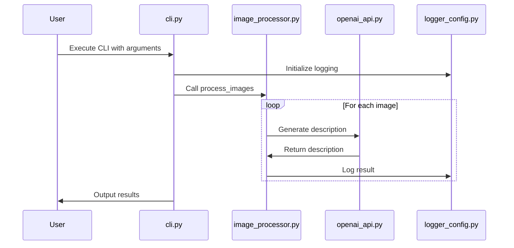
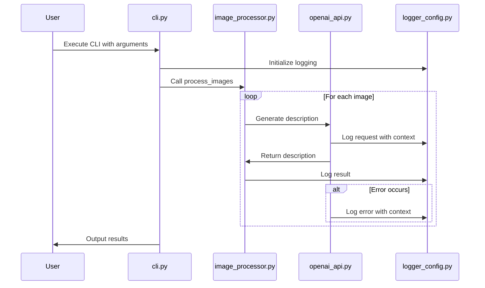
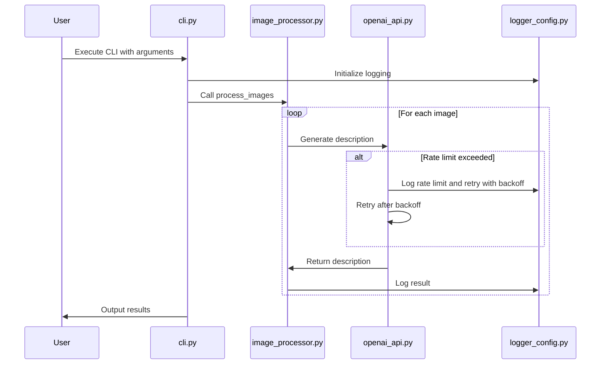
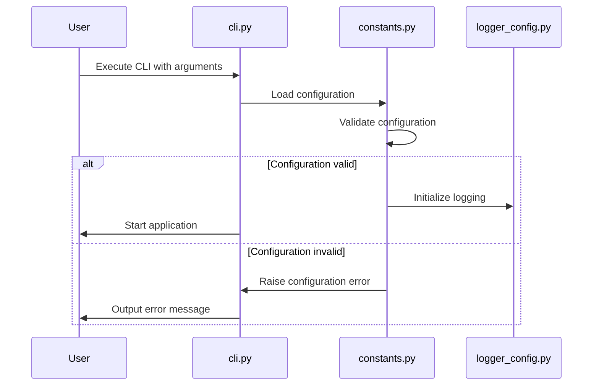
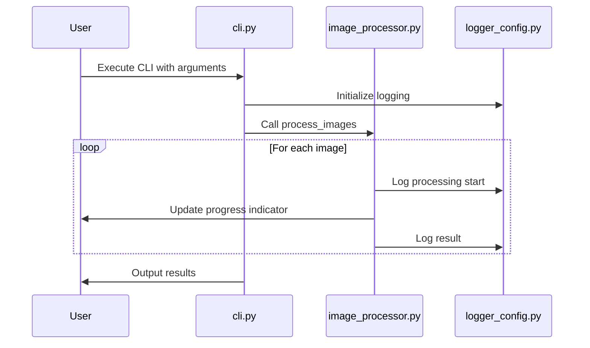
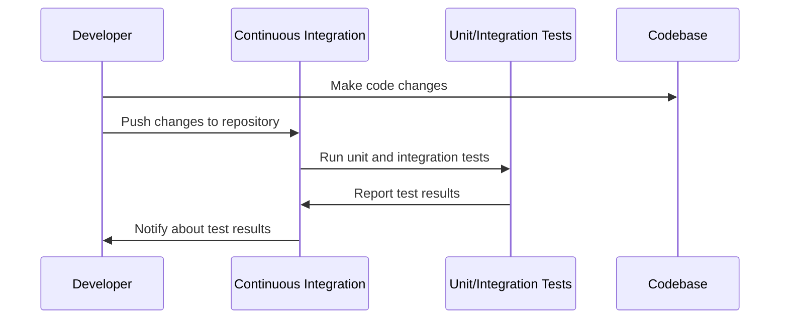

# Comprehensive Analysis of the Gen-Captions Codebase and Roadmap Items

## Overview

The Gen-Captions project is an image caption generation tool that leverages OpenAI's API to generate detailed and accurate captions for images. The codebase is structured to handle image processing, environment configuration, logging, and interaction with the OpenAI API. This analysis will delve into the various components of the codebase, providing insights into its functionality and design.

## Project Structure

The project is organized into several Python modules, each responsible for specific functionalities. Below is a high-level overview of the project structure:

```plaintext
gen-captions/
│
├── __init__.py
├── __version__.py
├── cli.py
├── constants.py
├── encoding_fixer.py
├── image_processor.py
├── logger_config.py
├── openai_api.py
├── system_info.py
└── utils.py
```

Additionally, there are configuration and setup files such as `pyproject.toml` and `run_aider.py`.

## Configuration and Setup

### `pyproject.toml`

This file is used for project configuration, specifying dependencies, build system requirements, and metadata about the project. It includes sections for:

- **Build System**: Uses `hatchling` as the build backend.
- **Versioning**: Specifies the path for versioning.
- **Code Formatting**: Configures `black` for code formatting and `isort` for import sorting.
- **Project Metadata**: Provides details like project name, description, authors, and dependencies.

### `run_aider.py`

This script consolidates environment variables from multiple `.env` files into a temporary file and launches the `aider` tool. It handles:

- Merging environment variables from predefined `.env` files.
- Writing the consolidated environment to a temporary file.
- Executing the `aider` tool with the temporary environment file.
- Cleaning up the temporary file after execution.

## Core Modules

### `cli.py`

This module provides a command-line interface for the Gen-Captions tool. It uses `argparse` to parse command-line arguments and orchestrates the main functionalities:

- **Argument Parsing**: Configures arguments for image directory, captions directory, and configuration directory.
- **System Information**: Prints system information using `system_info.py`.
- **Image Processing**: Calls `process_images` from `image_processor.py` to generate captions.

### `constants.py`

This module loads environment variables and defines constants used throughout the project. It uses `python-dotenv` to load variables from `.env` files and sets defaults for various configurations like API keys, thread pool size, and logging levels.

### `encoding_fixer.py`

This module provides functionality to fix encoding issues in text files. It scans specified directories for text files and attempts to read them with different encodings, ultimately saving them in UTF-8 format.

### `image_processor.py`

This module handles the processing of images to generate captions. It uses a thread pool to process images asynchronously, submitting tasks to generate descriptions using the OpenAI API. It ensures that captions are only generated for images that do not already have a corresponding text file.

### `logger_config.py`

This module configures logging for the project. It sets up a logger with console and file handlers, using a rotating file handler to manage log file sizes. The logging level is configured based on environment variables.

### `openai_api.py`

This module interacts with the OpenAI API to generate image descriptions. It encodes images to base64 and sends requests to the API, handling retries and rate limits. The API response is processed to extract and return the generated caption.

### `system_info.py`

This module prints system information and environment variable settings. It logs details about the platform, machine, processor, and Python version, as well as any environment variables prefixed with `GETCAP_`.

### `utils.py`

This module provides utility functions used across the project. It includes functions to check if a prompt file exists and to encode images to base64 format.

## Workflow and Execution

The typical workflow for using the Gen-Captions tool involves:

1. **Environment Setup**: Ensure all necessary environment variables are set, either through `.env` files or directly in the environment.
2. **Running the CLI**: Execute the `cli.py` script with appropriate arguments for image and caption directories.
3. **Image Processing**: The script processes images in the specified directory, generating captions using the OpenAI API.
4. **Logging and Output**: Logs are generated to track the progress and any issues encountered during execution. Captions are saved as text files in the specified directory.

## Sequence Diagram

Below is a sequence diagram illustrating the flow of the main processes in the Gen-Captions tool:



## Conclusion

The Gen-Captions codebase is a well-structured project that integrates various components to provide a seamless image caption generation tool. It effectively utilizes OpenAI's API, handles environment configurations, and provides robust logging and error handling. This analysis has covered the core functionalities and workflow, providing insights into the design and execution of the project.

# Improvements Addendum

In this section, we will outline potential improvements to the Gen-Captions codebase. These improvements are prioritized based on their potential impact on the project's functionality, maintainability, and user experience.

## Improvement Addendum 1: Enhance Error Handling and Logging

### Summary

Improving error handling and logging mechanisms is crucial for diagnosing issues and ensuring the robustness of the application. Currently, the codebase logs errors and warnings, but there is room for more detailed and structured logging.

### Importance

- **For Developers**: Enhanced logging provides more context for debugging and understanding application behavior, especially in production environments.
- **For Non-Developers**: Clear error messages and logs can help in understanding what went wrong without needing to dive into the code.

### High-Level Details

- Implement structured logging to include more context, such as request IDs or user actions.
- Use logging levels more effectively to differentiate between critical errors and informational messages.
- Consider integrating a centralized logging system for better monitoring and alerting.

## Improvement Addendum 2: Optimize API Interaction

### Summary

The interaction with the OpenAI API can be optimized to reduce latency and improve throughput. This involves refining the request handling and retry logic.

### Importance

- **For Developers**: Optimized API calls can reduce costs and improve performance, especially when processing large batches of images.
- **For Non-Developers**: Faster processing times enhance user satisfaction and efficiency.

### High-Level Details

- Implement exponential backoff with jitter for retry logic to avoid thundering herd problems.
- Batch API requests where possible to reduce the number of calls and improve efficiency.
- Monitor API usage to identify and address bottlenecks.

## Improvement Addendum 3: Improve Configuration Management

### Summary

The current configuration management relies heavily on environment variables, which can be cumbersome to manage across different environments.

### Importance

- **For Developers**: A more flexible configuration system can simplify deployment and testing across various environments.
- **For Non-Developers**: Easier configuration management reduces the likelihood of misconfiguration and associated errors.

### High-Level Details

- Consider using a configuration management library that supports hierarchical and environment-specific configurations.
- Provide a clear and comprehensive configuration guide for users.

## Improvement Addendum 4: Enhance User Interface and Experience

### Summary

Improving the command-line interface (CLI) and user experience can make the tool more accessible and user-friendly.

### Importance

- **For Developers**: A well-designed CLI can reduce the learning curve and improve productivity.
- **For Non-Developers**: A user-friendly interface makes the tool more approachable and easier to use.

### High-Level Details

- Implement more descriptive help messages and usage examples in the CLI.
- Consider adding a graphical user interface (GUI) for users who prefer not to use the command line.
- Provide feedback and progress indicators during long-running operations.

## Improvement Addendum 5: Increase Test Coverage

### Summary

Increasing test coverage ensures that the codebase is reliable and changes do not introduce regressions.

### Importance

- **For Developers**: Comprehensive tests provide confidence in the code and facilitate refactoring and feature additions.
- **For Non-Developers**: Reliable software reduces downtime and unexpected behavior, enhancing trust in the tool.

### High-Level Details

- Implement unit tests for all modules, focusing on edge cases and error conditions.
- Use integration tests to verify the interaction between components, especially API calls.
- Consider using a continuous integration (CI) system to automate testing.

## Improvement Addendum 6: Refactor Code for Maintainability

### Summary

Refactoring the codebase can improve its readability, maintainability, and scalability.

### Importance

- **For Developers**: Clean and well-organized code is easier to understand, modify, and extend.
- **For Non-Developers**: A maintainable codebase ensures the longevity and adaptability of the tool.

### High-Level Details

- Identify and refactor code smells, such as duplicated code or overly complex functions.
- Adopt consistent naming conventions and coding standards across the codebase.
- Modularize code to separate concerns and improve reusability.

These improvements aim to enhance the overall quality and usability of the Gen-Captions tool, making it more robust, efficient, and user-friendly for both developers and non-developers.

# Improvement Addendum 1: Enhance Error Handling and Logging

## In-Depth Analysis

Enhancing error handling and logging is a critical improvement for the Gen-Captions project. This section will expand on the summary provided earlier, detailing the design, architecture, and code changes necessary to implement this improvement.

### Design and Architecture

The goal is to create a robust logging and error-handling system that provides detailed insights into the application's behavior and errors. This involves:

1. **Structured Logging**: Implementing structured logging to capture detailed context about each log entry.
2. **Enhanced Error Messages**: Providing more informative error messages that include context and potential solutions.
3. **Centralized Logging**: Considering the integration of a centralized logging system for better monitoring and alerting.

### Code Changes

#### Structured Logging

Structured logging involves capturing additional context with each log entry, such as request IDs, user actions, and timestamps. This can be achieved by modifying the existing logging configuration.

**Code Change 1: Update `logger_config.py` for Structured Logging**

```python
# gen_captions/logger_config.py

import logging
from logging.handlers import RotatingFileHandler
from .constants import LOG_LEVEL

# Configure logging
logging.basicConfig(
    format="%(asctime)s [%(threadName)s] [%(levelname)s] %(message)s",
    level=LOG_LEVEL,
)
logger = logging.getLogger(__name__)
logger.setLevel(LOG_LEVEL)

formatter = logging.Formatter(
    "%(asctime)s [%(threadName)s] [%(levelname)s] %(message)s [%(filename)s:%(lineno)d]"
)

console_handler = logging.StreamHandler()
console_handler.setFormatter(formatter)

file_handler = RotatingFileHandler("gen_captions.log", mode="a", maxBytes=10485760, backupCount=5)
file_handler.setFormatter(formatter)

logger.addHandler(console_handler)
logger.addHandler(file_handler)

# Example of structured logging with additional context
def log_with_context(message, **context):
    context_str = " ".join(f"{key}={value}" for key, value in context.items())
    logger.info(f"{message} {context_str}")

# Usage
log_with_context("Processing image", image_path="path/to/image.jpg", user_id=123)
```

#### Enhanced Error Messages

To provide more informative error messages, we can update the error handling logic to include potential solutions or next steps.

**Code Change 2: Update Error Handling in `openai_api.py`**

```python
# gen_captions/openai_api.py

import requests

# Existing imports...

def generate_description(image_path):
    """Generate a description for the image using the OpenAI API."""
    logger.info(f"Processing image {image_path}...")
    base64_image = encode_image(image_path)
    retries = 0
    while retries < THROTTLE_RETRIES:
        try:
            response = client.chat.completions.create(
                # Existing API call...
            )
            if response and response.choices:
                return response.choices[0].message.content.strip()
            return None
        except requests.exceptions.HTTPError as e:
            if e.response.status_code == 429:
                retries += 1
                wait_time = THROTTLE_BACKOFF_FACTOR ** retries
                logger.warning(f"Rate limit exceeded. Retrying in {wait_time} seconds...")
                time.sleep(wait_time)
            else:
                logger.error(f"HTTP error occurred: {e}. Check your API key and network connection.")
                break
        except Exception as e:
            logger.error(f"Error processing image {image_path}: {e}. Ensure the image path is correct and the file is accessible.")
            break
    return None
```

### Centralized Logging

For centralized logging, consider integrating a service like ELK Stack (Elasticsearch, Logstash, Kibana) or a cloud-based solution like AWS CloudWatch or Azure Monitor. This would involve sending logs to a central server for aggregation and analysis.

### Sequence Diagram

Below is a sequence diagram illustrating the enhanced logging and error handling process:



### Conclusion

By implementing structured logging, enhancing error messages, and considering centralized logging, the Gen-Captions project can significantly improve its error handling and logging capabilities. This will provide developers with better tools for debugging and monitoring, while also offering non-developers clearer insights into the application's operation and potential issues.

# Improvement Addendum 2: Optimize API Interaction

## In-Depth Analysis

Optimizing the interaction with the OpenAI API is essential for improving the performance and efficiency of the Gen-Captions tool. This section expands on the summary provided earlier, detailing the design, architecture, and code changes necessary to implement this improvement.

### Design and Architecture

The optimization of API interaction involves several key strategies:

1. **Exponential Backoff with Jitter**: Implementing a retry strategy that reduces the load on the API server during high traffic periods.
2. **Batch Processing**: Sending multiple requests in a single batch to minimize the number of API calls.
3. **Monitoring and Metrics**: Tracking API usage and performance metrics to identify bottlenecks and optimize further.

### Code Changes

#### Exponential Backoff with Jitter

Exponential backoff with jitter is a technique used to handle retries in a distributed system. It involves waiting for an exponentially increasing amount of time before retrying a failed request, with a random jitter added to prevent synchronized retries.

**Code Change 2: Implement Exponential Backoff with Jitter in `openai_api.py`**

```python
# gen_captions/openai_api.py

import random
import requests

# Existing imports...

def generate_description(image_path):
    """Generate a description for the image using the OpenAI API."""
    logger.info(f"Processing image {image_path}...")
    base64_image = encode_image(image_path)
    retries = 0
    while retries < THROTTLE_RETRIES:
        try:
            response = client.chat.completions.create(
                # Existing API call...
            )
            if response and response.choices:
                return response.choices[0].message.content.strip()
            return None
        except requests.exceptions.HTTPError as e:
            if e.response.status_code == 429:
                retries += 1
                wait_time = (THROTTLE_BACKOFF_FACTOR ** retries) + random.uniform(0, 1)
                logger.warning(f"Rate limit exceeded. Retrying in {wait_time:.2f} seconds...")
                time.sleep(wait_time)
            else:
                logger.error(f"HTTP error occurred: {e}. Check your API key and network connection.")
                break
        except Exception as e:
            logger.error(f"Error processing image {image_path}: {e}. Ensure the image path is correct and the file is accessible.")
            break
    return None
```

#### Batch Processing

Batch processing involves grouping multiple requests into a single API call. This can reduce the number of requests sent to the API and improve throughput. However, the OpenAI API may not support batch processing directly, so this would require checking the API documentation for support or implementing a custom solution.

### Monitoring and Metrics

Implementing monitoring and metrics involves tracking API usage, response times, and error rates. This can be done using a monitoring tool or custom logging.

### Sequence Diagram

Below is a sequence diagram illustrating the optimized API interaction process:



### Conclusion

By implementing exponential backoff with jitter, exploring batch processing, and monitoring API usage, the Gen-Captions project can optimize its interaction with the OpenAI API. This will lead to improved performance, reduced costs, and a better user experience.

# Improvement Addendum 3: Improve Configuration Management

## In-Depth Analysis

Improving configuration management is essential for simplifying the deployment and maintenance of the Gen-Captions tool across different environments. This section expands on the summary provided earlier, detailing the design, architecture, and code changes necessary to implement this improvement.

### Design and Architecture

The goal is to create a flexible and robust configuration management system that can handle different environments and provide clear configuration options. This involves:

1. **Hierarchical Configuration**: Implementing a system that supports environment-specific configurations.
2. **Configuration Validation**: Ensuring that configurations are valid and complete before the application starts.
3. **Documentation and Usability**: Providing clear documentation and user-friendly configuration options.

### Code Changes

#### Hierarchical Configuration

Hierarchical configuration allows for different settings based on the environment (e.g., development, testing, production). This can be achieved using a configuration library that supports such features.

**Code Change 3: Implement Hierarchical Configuration in `constants.py`**

```python
# gen_captions/constants.py

import os
from dotenv import load_dotenv
from pathlib import Path
import configparser

# Load environment variables
envs = [".env", ".env.aider", ".env.aider.local", ".env.local"]
for env in envs:
    if os.path.exists(env):
        load_dotenv(dotenv_path=env, override=True, verbose=True)

# Load hierarchical configuration
config = configparser.ConfigParser()
config.read([str(Path.home() / 'gen_captions.ini'), 'gen_captions.ini'])

def get_config_value(section, key, default=None):
    """Get a configuration value with a fallback to environment variables."""
    return config.get(section, key, fallback=os.getenv(key, default))

OPENAI_API_KEY = get_config_value('API', 'OPENAI_API_KEY')
THREAD_POOL = int(get_config_value('Performance', 'GETCAP_THREAD_POOL', 10))
THROTTLE_RETRIES = int(get_config_value('Performance', 'GETCAP_THROTTLE_RETRIES', 10))
THROTTLE_BACKOFF_FACTOR = float(get_config_value('Performance', 'GETCAP_THROTTLE_BACKOFF_FACTOR', 2))
LOG_LEVEL = get_config_value('Logging', 'GETCAP_LOG_LEVEL', "INFO")
THROTTLE_SUBMISSION_RATE = float(get_config_value('Performance', 'GETCAP_THROTTLE_SUBMISSION_RATE', 1))
```

#### Configuration Validation

Configuration validation ensures that all necessary configurations are set and valid before the application starts. This can be done by adding checks and raising errors if configurations are missing or invalid.

**Code Change 4: Add Configuration Validation**

```python
# gen_captions/constants.py

def validate_configuration():
    """Validate configuration settings."""
    if not OPENAI_API_KEY:
        raise ValueError("OPENAI_API_KEY is not set. Please provide a valid API key.")
    if THREAD_POOL <= 0:
        raise ValueError("THREAD_POOL must be greater than 0.")
    if THROTTLE_RETRIES < 0:
        raise ValueError("THROTTLE_RETRIES cannot be negative.")
    if THROTTLE_BACKOFF_FACTOR <= 0:
        raise ValueError("THROTTLE_BACKOFF_FACTOR must be greater than 0.")
    if THROTTLE_SUBMISSION_RATE <= 0:
        raise ValueError("THROTTLE_SUBMISSION_RATE must be greater than 0.")

# Call validation at the start of the application
validate_configuration()
```

### Documentation and Usability

Providing clear documentation and user-friendly configuration options involves creating a comprehensive guide on how to configure the application for different environments and use cases.

### Sequence Diagram

Below is a sequence diagram illustrating the improved configuration management process:



### Conclusion

By implementing hierarchical configuration, adding validation, and improving documentation, the Gen-Captions project can enhance its configuration management. This will simplify deployment and maintenance, reduce errors, and provide a better user experience.

# Improvement Addendum 4: Enhance User Interface and Experience

## In-Depth Analysis

Enhancing the user interface and experience is vital for making the Gen-Captions tool more accessible and user-friendly. This section expands on the summary provided earlier, detailing the design, architecture, and code changes necessary to implement this improvement.

### Design and Architecture

The goal is to improve the command-line interface (CLI) and overall user experience by:

1. **Descriptive Help Messages**: Providing detailed help messages and usage examples.
2. **Progress Indicators**: Implementing feedback mechanisms to inform users about the progress of operations.
3. **Graphical User Interface (GUI)**: Considering the addition of a GUI for users who prefer not to use the command line.

### Code Changes

#### Descriptive Help Messages

Enhancing the help messages involves updating the `argparse` configuration to include more detailed descriptions and examples.

**Code Change 4: Update CLI Help Messages in `cli.py`**

```python
# gen_captions/cli.py

import argparse

def config_arg_parser():
    parser = argparse.ArgumentParser(
        description="Caption Generator v1.0.5 - Generate image captions for all images in a folder using OpenAI.",
        epilog="Example usage:\n  python cli.py --image-dir /path/to/images --caption-dir /path/to/captions --config-dir /path/to/config"
    )
    parser.add_argument("--fix-encoding", action="store_true", help="Fix encoding issues in text files.")
    parser.add_argument("--image-dir", help="Directory containing images to process.", required='--fix-encoding' not in sys.argv)
    parser.add_argument("--caption-dir", help="Directory to save generated captions.", required=True)
    parser.add_argument("--config-dir", help="Directory containing configuration files.", required=True)
    return parser

def main():
    parser = config_arg_parser()
    print("\r\n" * 1)
    print(parser.description)
    print("\r\n" * 1)
    args = parser.parse_args()
    print("\r\n" * 2)
    print_system_info()
    print("\r\n" * 2)

    # Existing logic...
```

#### Progress Indicators

Implementing progress indicators can be done using a library like `tqdm` to provide real-time feedback on the progress of image processing.

**Code Change 5: Add Progress Indicators in `image_processor.py`**

```python
# gen_captions/image_processor.py

from tqdm import tqdm

def process_images(image_directory, caption_directory):
    """Process images in the directory and generate descriptions asynchronously."""
    logger.info("Starting to process images...")
    image_files = [f for f in os.listdir(image_directory) if f.lower().endswith((".jpg", ".jpeg", ".png"))]
  
    with ThreadPoolExecutor(max_workers=THREAD_POOL) as executor:
        futures = []
        with tqdm(total=len(image_files), desc="Processing Images") as pbar:
            for filename in image_files:
                txt_filename = os.path.splitext(filename)[0] + ".txt"
                txt_path = os.path.join(caption_directory, txt_filename)

                if not prompt_exists(txt_path):
                    image_path = os.path.join(image_directory, filename)
                    logger.info(f"Submitting {filename} for processing...")
                    future = executor.submit(partial(generate_description, image_path))
                    futures.append((future, txt_path, filename))
                    time.sleep(1 / THROTTLE_SUBMISSION_RATE)  # Add delay between task submissions
                else:
                    logger.info(f"Skipping: {filename}. Prompt already exists.")

            for future in as_completed([f[0] for f in futures]):
                try:
                    description = future.result()
                    description = description.encode('utf-8', 'ignore').decode('utf-8')
                    for f in futures:
                        if f[0] == future:
                            txt_path = f[1]
                            filename = f[2]
                            break
                    if description:
                        if "[trigger]" in description:
                            with open(txt_path, "w", encoding="utf-8") as txt_file:
                                txt_file.write(description)
                            logger.info(f"Processed: {filename}")
                        else:
                            logger.info(f"Rejected content for: {filename}. No [trigger] found.")
                    pbar.update(1)
                except Exception as e:
                    logger.error(f"Error processing image: {e}")
                    pbar.update(1)
    logger.info("Finished processing images.")
```

### Graphical User Interface (GUI)

While a full GUI implementation is beyond the scope of this document, considering a GUI could involve using a framework like Tkinter or PyQt to create a simple interface for selecting directories and starting the caption generation process.

### Sequence Diagram

Below is a sequence diagram illustrating the enhanced user interface and experience process:



### Conclusion

By enhancing the CLI with descriptive help messages, adding progress indicators, and considering a GUI, the Gen-Captions project can significantly improve its user interface and experience. This will make the tool more accessible and user-friendly for both developers and non-developers.

# Improvement Addendum 5: Increase Test Coverage

## In-Depth Analysis

Increasing test coverage is essential for ensuring the reliability and robustness of the Gen-Captions tool. This section expands on the summary provided earlier, detailing the design, architecture, and code changes necessary to implement this improvement.

### Design and Architecture

The goal is to implement comprehensive testing that covers:

1. **Unit Tests**: Testing individual functions and modules for correctness.
2. **Integration Tests**: Verifying the interaction between different components.
3. **Continuous Integration (CI)**: Automating the testing process to ensure code quality.

### Code Changes

#### Unit Tests

Unit tests focus on testing individual functions and methods to ensure they work as expected. This involves creating test cases for each function, covering various input scenarios and edge cases.

**Code Change 5: Add Unit Tests for `utils.py`**

```python
# tests/test_utils.py

import unittest
from gen_captions.utils import prompt_exists, encode_image
import os

class TestUtils(unittest.TestCase):

    def setUp(self):
        # Setup code to create a temporary file for testing
        self.test_file = "test_prompt.txt"
        with open(self.test_file, "w") as f:
            f.write("Test content")

    def tearDown(self):
        # Cleanup code to remove the temporary file
        if os.path.exists(self.test_file):
            os.remove(self.test_file)

    def test_prompt_exists(self):
        # Test when the file exists and is not empty
        self.assertTrue(prompt_exists(self.test_file))
    
        # Test when the file does not exist
        self.assertFalse(prompt_exists("non_existent_file.txt"))

    def test_encode_image(self):
        # Test encoding of a sample image
        image_path = "sample_image.jpg"
        with open(image_path, "wb") as f:
            f.write(os.urandom(1024))  # Create a dummy image file

        encoded_image = encode_image(image_path)
        self.assertIsInstance(encoded_image, str)
        self.assertGreater(len(encoded_image), 0)

        os.remove(image_path)

if __name__ == '__main__':
    unittest.main()
```

#### Integration Tests

Integration tests verify that different components of the system work together as expected. This involves testing the complete workflow, such as processing images and generating captions.

**Code Change 6: Add Integration Tests for `cli.py`**

```python
# tests/test_cli.py

import unittest
import subprocess
import os

class TestCLI(unittest.TestCase):

    def test_cli_execution(self):
        # Test the CLI execution with sample arguments
        result = subprocess.run(
            ["python", "gen_captions/cli.py", "--image-dir", "test_images", "--caption-dir", "test_captions", "--config-dir", "test_config"],
            capture_output=True,
            text=True
        )
        self.assertEqual(result.returncode, 0)
        self.assertIn("Starting to process images...", result.stdout)

if __name__ == '__main__':
    unittest.main()
```

### Continuous Integration (CI)

Implementing CI involves setting up a CI/CD pipeline to automate the testing process. This ensures that tests are run automatically on every code change, maintaining code quality and preventing regressions.

### Sequence Diagram

Below is a sequence diagram illustrating the testing process:



### Conclusion

By increasing test coverage through unit and integration tests and implementing continuous integration, the Gen-Captions project can ensure its reliability and robustness. This will provide confidence in the codebase and facilitate future development and maintenance.
